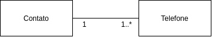

# Agenda de Contatos

API em SF4 para treinar e experimentar algumas coisas

## Para subir o projeto

Gere o arquivo .env na raiz do projeto usando como base o arquivo .env.dist

Tenha o docker e docker-compose configurado em sua máquina e rode na raiz do projeto
```
docker-compose build
```

```
docker-compose up
```

Acesse a docker
```

```

Gere o banco de dados a partir das nossas entidades
```

```

## Rodando os Testes

Acesse a docker
```

```

Rode os testes
```

```

## Especificação

### Requisitos Funcionais

|  #  |  Nome  |  Descrição  |
|---|---|---|
|  FN01  |  Manter Contato  |  Sistema deve permitir manter contatos.  |
|  FN02  |  Manter Telefones de um Contato  |  Sistema deve permitir manter os telefones de um contato.  |

### Regras de Negócio

|  #  |  Nome  |  Descrição  |
|---|---|---|
|  RN01  |  Atributos obrigatórios  |  Um contato deve ter no mínimo o nome e um telefone.  |
|  RN02  |  Telefone duplicado  |   Não deve ser possível cadastrar um mesmo telefone para o mesmo contato.  |
|  RN03  |  Contato duplicado  |   Não deve ser possível cadastrar um contato com um nome já utilizado.  |

### Modelo de Domínio

